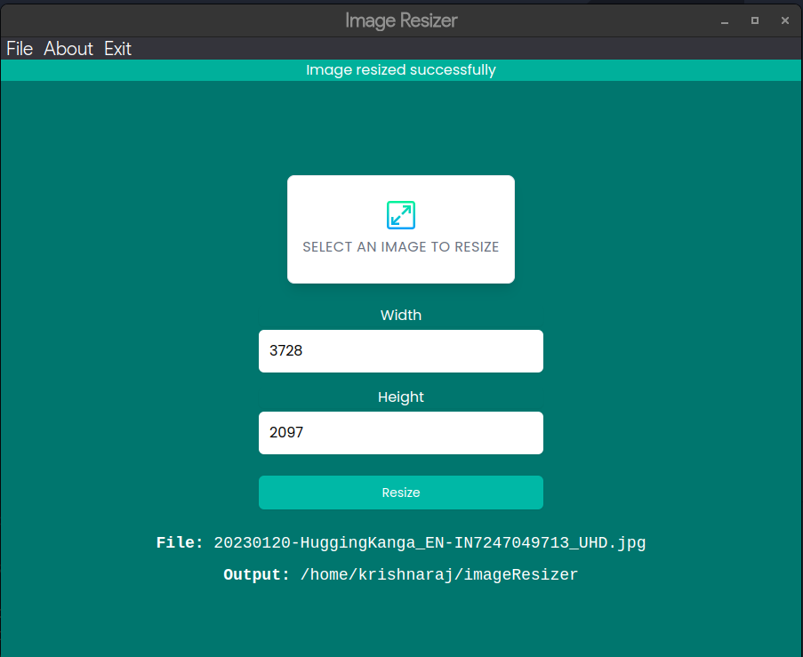

# Image-Resizer

Application to resize images, but a very basic one, done basically just to learn electronjs.

# Screenshot

# Credits

-   [Electron](https://electronjs.org/)
-   [Electron Forge](https://electronforge.io/)

This was made by following the tutorial on how to make electron apps by:
[Travesy Media](https://www.traversymedia.com/) on [this youtube video](https://www.youtube.com/watch?v=ML743nrkMHw), so special thanks to him for the tutorial, and helping me getting started with electron.
